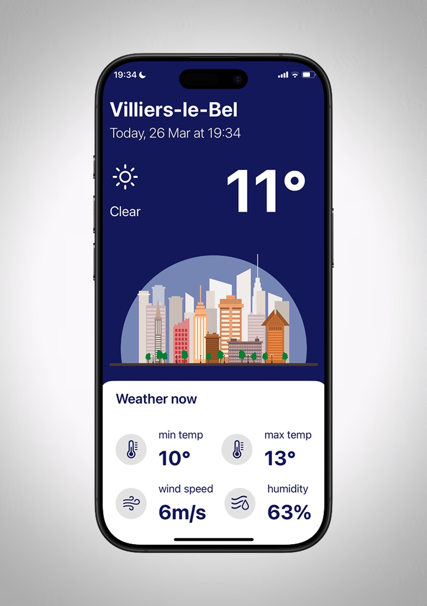
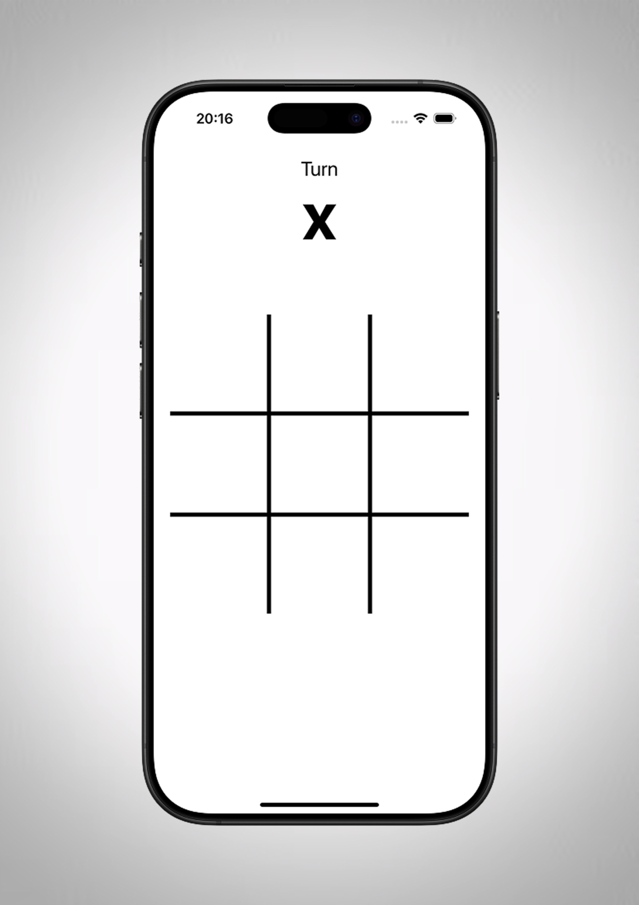
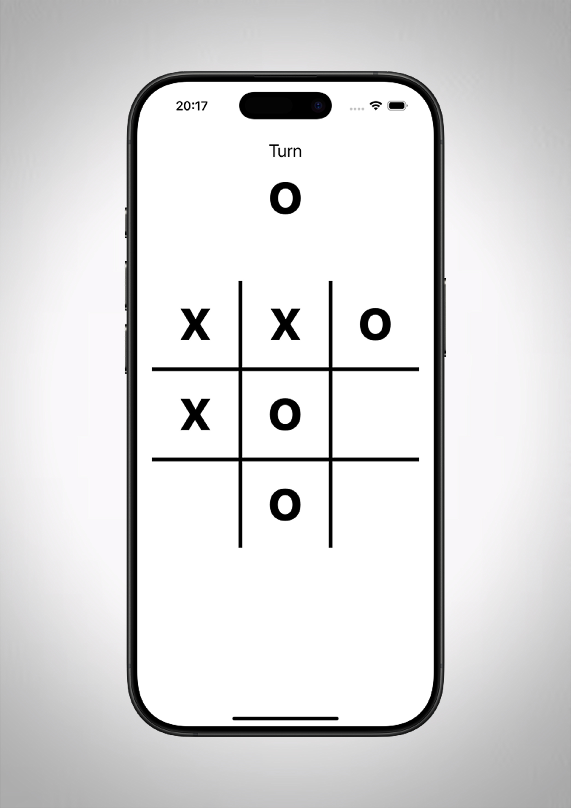
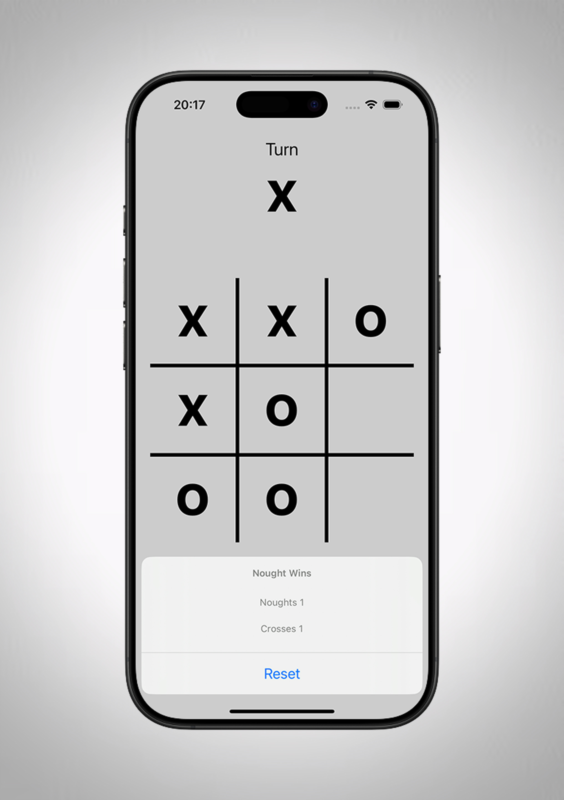

# Portfolio

Bienvenue sur mon portfolio !

## À propos de moi
Je suis un développeur iOS passionné par la création d'applications mobiles. Voici quelques-uns de mes projets récents réalisés avec UIKit et SwiftUI.

---

## Projets

### 1. [Weather App](https://github.com/votre-repo)
Ce projet est une application météo qui utilise l'API OpenWeather pour afficher les conditions météorologiques en temps réel. Ce projet m'a permis de me familiariser avec SwiftUI et les appels réseau.

**Captures d'écran :**

**Technologies utilisées :**
- SwiftUI
- OpenWeather API
- JSON Parsing

**Fonctionnalités :**
- Affichage de la météo actuelle
- Détails sur la température, la vitesse du vent et l'humidité
- Localisation automatique

---

### 2. [Tic Tac Toe](https://github.com/votre-repo)
Mon premier projet est un jeu classique de Tic Tac Toe, développé avec UIKit. Ce projet m'a permis d'explorer les bases du développement d'interfaces graphiques sur iOS et de gérer les interactions utilisateurs.

**Captures d'écran :**

**Technologies utilisées :**
- UIKit
- Swift

**Fonctionnalités :**
- Affichage dynamique du joueur en cours (X ou O)
- Gestion des scores
- Réinitialisation de la partie

---

Merci d'avoir consulté mon portfolio ! N'hésitez pas à explorer les projets sur mon GitHub.

